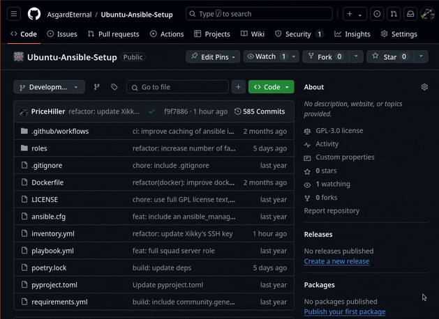

# Updating the Squad Servers

Listed in order:

## 1. Build the new Squad Docker Server image with the latest Squad Server version

> [!WARNING]
> Be careful when doing this when the server is full. It can (and generally does) use the full server's compute resources (pins the CPU to 100%) and can degrade other services while the image is running. For example, it can make the Squad Server for current players laggy while the CPU struggles to build the image and host the server at the same time.

1.  Visit the [`SquadDocker`](https://github.com/AsgardEternal/SquadDocker) repository
2.  Head to [`actions > Docker Image CI`](https://github.com/AsgardEternal/SquadDocker/actions/workflows/main.yml)
3.  Hit the `Run workflow` button
4.  In the pop up that appears, hit the green `Run workflow` button
    - Now wait until the CI job finishes, you can watch the latest CI job for building the new Squad server image at [https://github.com/AsgardEternal/SquadDocker/actions].

> [!NOTE]
> You can refer to the recording below showing those steps:
> 

## 2. Now we need to actually enable/redeploy the new Squad Server

> [!NOTE]
> The reason why we need to redeploy the Squad Server is that the current running instances of the squad servers are actually using the **_previous_** docker image and we need it to use our newly built one. That means we just need to restart the images as the docker compose file is set up to automatically pull and use the latest built image 😉.

> [!WARNING]
> Be **_very_** careful when doing this. Ensure that the server is empty or near empty, if you run this while the server has players in it, the players will be booted as this **_restarts_** the server.

1.  Visit the [`Ubuntu-Ansible-Setup`](https://github.com/AsgardEternal/Ubuntu-Ansible-Setup)
2.  Head to [`actions > Docker Image CI`](https://github.com/AsgardEternal/Ubuntu-Ansible-Setup/actions/workflows/start-squad.yml)
3.  Hit the `Run workflow` button
4.  In the pop up that appears, hit the green `Run workflow` button
5.  Once the workflow finishes, validate in the server browser that the server has been updated

> [!NOTE]
> You can refer to the recording below showing those steps:
> 


## FAQ

### The server isn't updated, but I followed all the steps! What do I do?

Commonly, when this occurs it means that a docker cache wasn't cleared correctly. If that occurs, buckle up because this is going to be a not so fun time.

You'll need to ssh over to the server via `ssh asgard@asgard-eternal.com` and start doing some debugging for all the following steps.

> [!WARNING]
> All the following steps are **_DESTRUCTIVE_**! If there's a live squad match being played in the server, maybe wait until the server has limited or no players before taking any of the following actions!

1. Check the latest Squad docker image via `docker image ls asgard-eternal.com/squad`:

   ```
   asgard@chi-1-2-23:~$ docker image ls asgard-eternal.com/squad
   REPOSITORY                 TAG              IMAGE ID       CREATED      SIZE
   asgard-eternal.com/squad   steel-division   41b6cc5eb166   5 days ago   25.5GB
   asgard-eternal.com/squad   tac-latest       6c15311c880c   5 days ago   31.1GB
   asgard-eternal.com/squad   latest           404523503b97   5 days ago   13.6GB
   asgard-eternal.com/squad   <none>           7e94015a9e45   5 days ago   31.1GB
   asgard-eternal.com/squad   <none>           09e57bcae79a   5 days ago   25.5GB
   ```

   Compare the `CREATED` time to your CI run. Notably look for the `TAG` section, untagged images can be ignored. (E.x. if you're debugging the vanilla server, look for the `latest` tag).

   If the `CREATED` date looks wrong, try running the CI job again. If that **_still_** fails, move on to the nuclear option of wiping out all the Squad images via `docker image rm`.

   For example, we can wipe out the latest Squad vanilla image by entering: `docker image rm --force asgard-eternal.com/squad:latest`. (The force is done to ensure we ignore any dangling references or running images, if we're at this point we don't care about that.)

   Once that is done, rerun the CI job. You should have the latest Squad image correctly loaded now.

2. If the above didn't work, then likely the docker compose file managing the actual services didn't correctly pull down the updated image and is still using an incorrect image version.

   To correct that we can manually make docker compose do a image pull. On the server `cd` to `/home/asgard/Squad-Servers`. In that directory is a `docker-compose.yml` file that defines all of the Squad services.

   Run the following in order:

   1. `docker compose down` to shut down the various services
   2. `docker compose pull` to now pull in the latest (and correct) version of the services
   3. `docker compose up -d` to re-enable and run the services (`-d` is to detach the service run from your session)

3. If all the above hasn't worked then the world is probably on fire, contact Price to pull you out of the mud.
